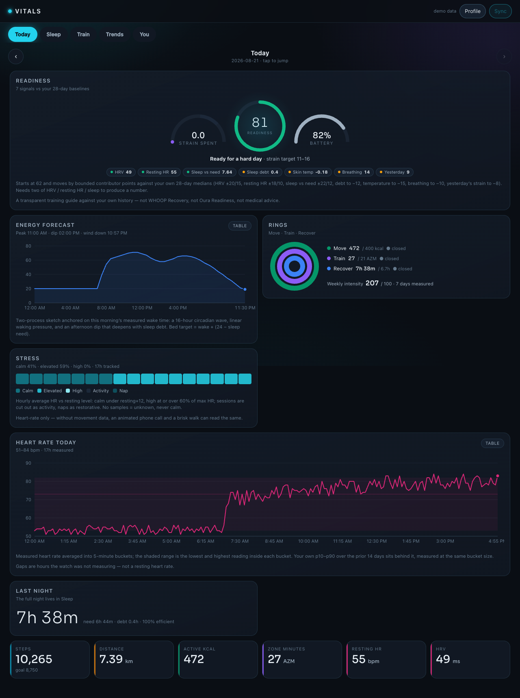
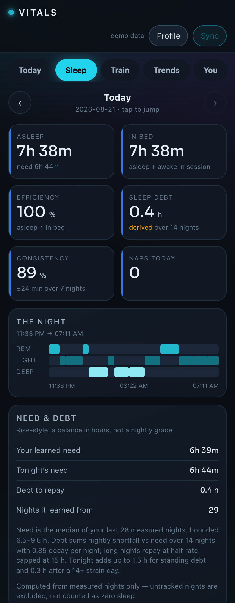
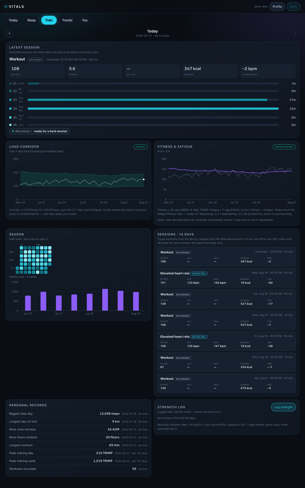
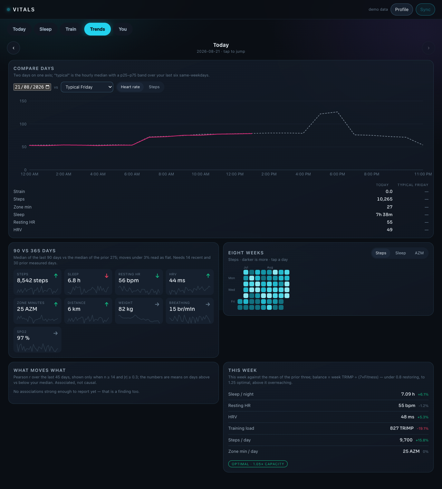
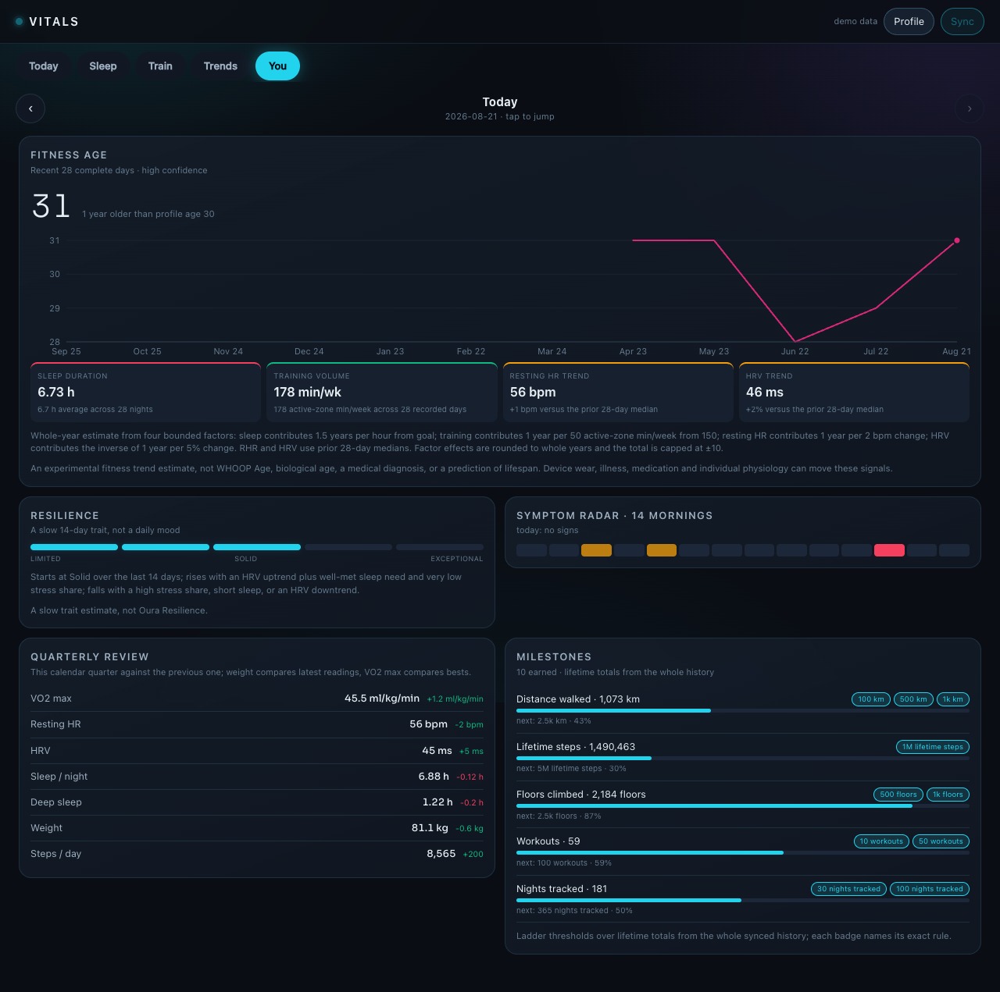
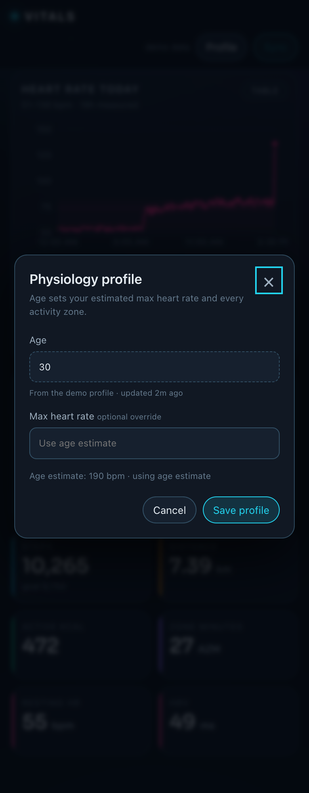

# vitals

Your own health dashboard. It syncs the **Google Health API** into the fleet's
MySQL store and turns it into five screens — Today, Sleep, Train, Trends, You —
with near-real-time updates via webhooks. Mobile-web first, laptop-ready.

One dependency (`mysql2`). Otherwise Node built-ins and vanilla JS — no framework,
no build step, no bundler.

```
npm run demo     # start with 180 days of generated data, no credentials needed
npm start        # start for real
npm test         # pure + MySQL-backed tests
```

Then open <http://localhost:4330>.

## What it looks like

Every screenshot below is `npm run demo` — generated data through the real
normalize → store → query path, so the layouts, scales and empty states are the ones
live data gets. No real health data is published in this repository.



*Today — readiness against your own 28-day baselines, every contributor shown, with
the strain target, energy forecast and the day's rings.*

<details>
<summary><b>The other four screens</b></summary>



*Sleep — the night first: hypnogram, learned need against rolling debt, overnight HR
dip, night temperature against your own band, and the month's pattern.*



*Train — typed workouts merged with HR-detected sessions, the healthy load corridor,
fitness/fatigue/form, a season heat calendar, and the strength log kept beside cardio
load rather than summed into it.*



*Trends — compare any day with any other (or with your typical same-weekday band) on
a single indexed axis, plus 90-vs-365-day verdicts.*



*You — the transparent fitness age with each bounded contribution named, a slow
resilience level, a quarterly review and lifetime milestones.*



*Profile — age is read from your Google account, not typed in. Max heart rate is the
one thing you can override, because a measured max beats any estimate.*

</details>

## The five rooms

Each screen asks one question and gets one purpose-built endpoint
(`/api/screen/today|sleep|train|trends|you`, plus `/api/screen/calendar` for the
date-jump overlay). These payloads are also the API a native app would consume —
they carry their own dates, units, methods and freshness.

- **Today** — heart rate through the day at five-minute buckets (each bucket's real
  min–max shaded, your own 14-day p10–p90 behind it, gaps left as gaps), a readiness
  score (0–100 against your own 28-day baselines, with
  every contributor shown), day strain on a bounded 0–21 TRIMP transform with a
  readiness-derived target band, an energy battery, an hourly stress timeline, a
  Rise-style energy forecast for the day ahead, three adaptive rings
  (Move · Train · Recover), PAI-style weekly intensity, and a symptom radar that
  only speaks when two or more overnight vitals leave your personal range.
- **Sleep** — the night first: hypnogram, time in bed, efficiency, naps (split
  from the main night, repaying debt at half rate), learned sleep need and rolling
  debt in hours, bed/wake consistency, overnight HR dip, night skin temperature
  against your band, and a monthly pattern report.
- **Train** — typed workouts merged with HR-detected sessions (10 min over 60%
  max HR; the typed recording wins on overlap), per-session effort, heart-rate
  recovery, fitness/fatigue/form (42/7-day EWMAs), a Gentler-Streak-style healthy
  load corridor, a recovery countdown in hours, a season heat calendar, personal
  records, and a manual strength log kept beside cardio load — never summed in.
- **Trends** — a compare workbench (any day vs any day, or vs your typical
  same-weekday with its p25–p75 band, on one axis), 90-vs-365-day trend verdicts,
  metric heat calendars, automated correlation cards (n ≥ 14, |r| ≥ 0.3, worded
  "associated"), and a weekly report with a load-vs-capacity balance.
- **You** — the transparent fitness age with a 12-month arc, a slow resilience
  level, symptom-radar history, a quarterly review, and lifetime milestones.

Everything is deliberately labelled **derived**, states its formula, and compares
you with yourself — never population norms, never WHOOP/Oura/Garmin's proprietary
scores, never medical advice. A missing measurement remains missing; it is never
turned into zero.

---

## Look at it first

`npm run demo` fills the store with realistic generated data so you can judge the
dashboard before touching Google Cloud. Demo points go through the *same*
normalize → store → query path as live data, so it exercises the real pipeline, and
every demo row is tagged `platform: DEMO` so the UI says so out loud.

Clear it from the setup panel, or `curl -XDELETE localhost:4330/api/demo`.

## Connecting Google Health

You need four things, in this order:

1. **A Google Cloud project with the Google Health API enabled.**
2. **An OAuth consent screen** (External). Add your own Google account under
   **Test users** — this is what lets a personal app work without going through
   full verification.
3. **An OAuth 2.0 *Web application* client.** Add this exact redirect URI:
   `http://localhost:4330/auth/callback` (or `$VITALS_BASE_URL/auth/callback`).
4. **The credentials in the environment**, then restart:

```bash
export GOOGLE_CLIENT_ID=...
export GOOGLE_CLIENT_SECRET=...
npm start
```

Click **Connect Google**. The app requests read-only scopes for the data types it
syncs, and nothing else.

### Two things about access, up front

**The API may not be open to you.** Google closed new Fitbit Web API signups in May
2024; the Google Health API (GA since March 2026) is its successor and reports
suggest a gated, restricted-scope review rather than open self-serve. If your Cloud
project cannot enable the API, that is an access decision on Google's side, not a
bug here.

**There must be a device feeding the account.** This API serves data that Fitbit /
Pixel Watch / connected apps write into Google Health. If nothing writes to your
account, the sync succeeds and returns nothing — which looks identical to a broken
app. The dashboard shows paired devices for exactly this reason.

### The 7-day refresh token

While the OAuth app is in **Testing**, Google **revokes refresh tokens after 7 days**.
This is a property of unpublished OAuth clients, not something code can fix. The app
detects the resulting `invalid_grant`, marks itself disconnected with that reason, and
asks for one click to reconnect. Publishing the app (Testing → In production) stops it
recurring.

## How syncing works

Two cursors per data type, running in opposite directions:

| | direction | cadence | purpose |
|---|---|---|---|
| **Tail** | forward | every 5 min | re-reads a 36-hour trailing window |
| **Backfill** | backward | in the gaps | walks history one max-window chunk at a time |

The trailing overlap is not paranoia. **Google restates data**: a watch that syncs at
22:00 rewrites the whole day, and sleep is routinely revised the next morning. A
cursor that only asks for "since last time" keeps the first, wrong version forever.
Points upsert on `(data_type, point_id)`, so re-reading a window costs quota, never
correctness.

Three API constraints the sync engine exists to respect:

- **Max query range is not uniform** — 14 days for `heart-rate`, `active-minutes`,
  `total-calories` and `calories-in-heart-rate-zone`; 90 days for everything else.
- **300 requests/minute per user.** All calls go through one token bucket set below
  the ceiling, with `Retry-After`-aware backoff on 429.
- **`pageSize` defaults to 1440.** Intraday heart rate blows past that in a day, so
  ignoring `nextPageToken` silently truncates and the chart looks fine while wrong.

### Near real time (webhooks)

Google pushes a notification when data changes, **for six types only**: steps,
altitude, distance, floors, weight, sleep. The payload says *what* changed over
*which interval* and carries no values, so a notification triggers a targeted fetch
of that window.

Needs a public HTTPS endpoint. Set `VITALS_WEBHOOK_SECRET`, then:

```bash
curl -XPOST localhost:4330/api/webhook/subscribe \
  -H 'content-type: application/json' \
  -d '{"projectNumber":"123456789012"}'   # the project NUMBER, not its id
```

Registration sends two probes: one **with** your Authorization header (must get
200/201) and one **without** (must get 401/403). The second is the real test — an
endpoint that 200s everything fails registration with `FAILED_PRECONDITION`. Payloads
are signed (ECDSA P-256, Tink keyset, rotated every 30 days) and verified against the
raw bytes before anything is acted on.

## Configuration

| Variable | Default | Meaning |
|---|---|---|
| `PORT` / `HOST` | `4330` / `127.0.0.1` | listen address |
| `MYSQL_HOST` / `MYSQL_PORT` | `127.0.0.1` / `3306` | database address |
| `MYSQL_USER` / `MYSQL_PASSWORD` | `vitals` / — | database credentials |
| `MYSQL_DATABASE` | `vitals` | database name |
| `GOOGLE_CLIENT_ID` / `_SECRET` | — | OAuth client |
| `VITALS_BASE_URL` | `http://localhost:4330` | public origin; the redirect URI derives from it |
| `VITALS_WEBHOOK_SECRET` | — | shared secret for the webhook endpoint |
| `VITALS_WEBHOOK_REQUIRE_SIGNATURE` | `1` | set `0` only to debug |
| `VITALS_BACKFILL_DAYS` | `365` | how far back to walk |
| `VITALS_TAIL_INTERVAL_SEC` | `300` | forward sync cadence |
| `VITALS_TAIL_OVERLAP_HOURS` | `36` | trailing re-read window |
| `VITALS_RATE_PER_MIN` | `240` | client-side cap (ceiling is 300) |
| `VITALS_DEMO` | — | `1` loads demo data at startup |

## Layout

```
server.js        routing only
lib/catalog.js   every data type: naming forms, filter field, units, chart form
lib/health.js    the ONLY module that calls Google for data (limits, chunks, pages)
lib/oauth.js     the ONLY module that handles tokens
lib/normalize.js dataPoint JSON -> row; defensive, records what it guessed
lib/db.js        MySQL storage; keeps the raw JSON alongside the derived value
lib/query.js     read side: series, stat tiles, tables, assistant digest
lib/insights.js  automatic activity sessions, recovery outlook, fitness age
lib/stats.js     shared robust statistics (median, quantile, EWMA, Pearson)
lib/scores.js    readiness, strain target, battery, stress, PAI, resilience, radar
lib/night.js     sleep need & debt, consistency, naps, HR dip, month pattern
lib/training.js  daily load, fitness/fatigue/form, corridor, sessions, records
lib/trends.js    baselines, verdicts, ghosts, heat, reports, correlations
lib/goals.js     adaptive goals, rings, badges
lib/screens.js   the five screen payloads composed from the modules above
lib/sync.js      tail + backfill engine
lib/webhook.js   receiver, handshake, signature verification
lib/demo.js      synthetic data through the real pipeline
public/          dashboard (charts.js is a hand-rolled SVG engine)
```

### Two design notes worth knowing before editing

**The raw dataPoint is always kept.** `points.raw` holds exactly what Google
returned; `value`/`fields`/`parts` are a re-computable projection. The v4 reference
publishes the envelope and the filter fields but not a per-type table of value field
names, so `lib/catalog.js` carries hint lists and `normalize.js` falls back to a
heuristic — recording every guess as a visible warning. When a hint turns out wrong,
`normalize.renormalize()` fixes history from the raw rows instead of forcing a
re-sync of data that may have aged out upstream.

**Charts never wait on Google.** Everything the dashboard renders comes from MySQL.
The sync loop is the only thing that talks upstream, so a slow, rate-limited or
disconnected Google leaves the dashboard fast and answerable.
